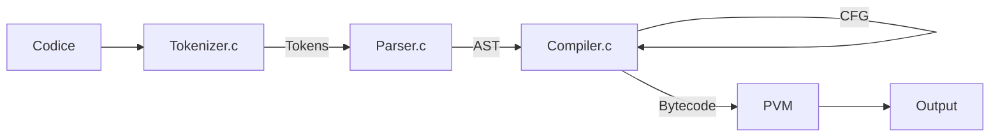

# Pylyp
Python ... but reversible

Descrizione in italiano:

## Capitolo 1: Sintesi del progetto

I codici qua descritti sono frutto del progetto di tesi triennale al dipartimento di informatica UNITO dell'anno 2020/2021, elaborato da Riccardo Giovanni Rosso (studente) e Luca Roversi (relatore).
L'idea che sta alla base del lavoro è la costruzione di un sistema di analisi di porzioni di codice reversibile scritto in Python.
Questa struttura ha inoltre l'intenzione di essere estendibile, sfruttando la catena di compilazione dell'implementazione Cpython di Python qua sotto visibile.

```flow
st=>start: Codice
lex=>operation: Analisi lessicale
pars=>operation: Analisi Sintattica
revpars=>operation: Pylyp:>https://github.com/Riccardo99Rosso/Pylyp
comp=>operation: Analisi Semantica 
e=>end: Output

st->lex->pars->revpars->comp->e
```

Il blocco "Pylyp" è dove il progetto si colloca e che comprende il nostro analizzatore mentre gli altri blocchi sono interni a Cpython e scritti in linguaggio C.
Se vogliamo avere un'idea più specifica di come i vari blocchi vengano concepiti da Python può essere utile visionare lo schema seguente:



Dove il **CGF** è un "Grafo di controllo" realizzato partendo dall'AST e che ha lo scopo di facilitare l'emissione del bytecode poi interpretato dalla PVM (Python Virtual Machine).

Ciò che segue è la descrizione del parser implementato in Python (versione 3.9) attraverso l'utilizzo della libreria interna "ast", creata appositamente per permettere agli sviluppatori un'analisi ad alto livello dell'AST prodotto dal Parser.c .

## Capitolo 2: Analizzatore

Cominciamo con la creazione di una nuova cartella dal nome `Pylyp` (nome scelto per il progetto) e creiamo il file `pylyp.py` come script che accetta un file in entrata (il codice da analizzare).
Una volta salvato il contenuto dell'argomento in una variabile code effettuiamo una prima analisi andando a controllare che le variabili delle varie funzioni non siano globali. E' infatti necessario che le funzioni siano chiuse (una funzione non chiusa è per definizione non reversibile).
Per fare ciò sfruttiamo un altro modulo particolarmente utile: "symtable".
Tale modulo è stato creato con l'idea di dare allo sviluppatore la possibilità di accedere facilmente alla symbol table andando, per ogni funzione, classe ... presente, a visualizzare le variabili e il loro scope.
Il codice di `pylyp.py` fino a questo momento risulta quindi essere:

```python
import sys
import ast
import symtable

if len(sys.argv) != 2:
    print("This script needs a file.py as an argument")
    sys.exit(0)

firstarg = (sys.argv[1])
f = open(firstarg, "r")
code = f.read()
    
#comments on errors
comments = False
#tree visualizer
visualize = False
#list of accepted functions
rev_functions = ["range"]

tree_ast = ast.parse(code, mode="exec")

st1 = symtable.symtable(code, 'sym_table', 'exec')
sub_st1 = st1.get_children()
fun_size = 0
is_reversible_symtable = []
for child in range(len(sub_st1)):
    if str(sub_st1[child].get_type()) == 'function':
        st2 = sub_st1[child]
        global_list = list(st2.get_globals())
        for f in rev_functions:
            if f in global_list:
                global_list.remove(f)
        if global_list:
            is_reversible_symtable.append(False)
        else:
            is_reversible_symtable.append(True)
        fun_size += 1
```

In "fun_size" si ha il numero di funzioni (ciò su cui si vuole fare l'analisi), in "rev_functions" possono essere inserite tutte quelle funzioni che lo sviluppatore conosce già come reversibili. La funzione "range" ad esempio, anche se reversibile, verrebbe scartata dalla prima parte di codice siccome la funzione che ne fa utilizzo non la definisce, perciò risulta necessario accettarla esplicitamente.

Le variabili "comments" e "visualize" creano rispettivamente come output aggiuntivo: le porzioni di codice che rendono la funzione non reversibile e la visualizzazione dell'albero generato.

Ora possiamo parsificare il codice con "ast.parse()" ricordandoci che vogliamo solo lavorare sulle funzioni.
La struttura generale sarà quindi del tipo:

```python
fun_count = 0
super_nodes = [node for node in ast.walk(tree_ast)]
for super_n in super_nodes:
    if isinstance(super_n, ast.FunctionDef):
        is_reversible = True
        nodes = [node for node in ast.walk(super_n)]
        for n in nodes:
			#analysis
```

Ogni volta che si incontra una funzione si catturano allora tutti i suoi nodi e si setta la sua reversibilità a True (che poi verrà messa in and con l'output generato dal codice riguardante la symbol table).
Importante: **il codice è scritto per non fermarsi anche quando si sa già che la funzione sia non reversibile**, questo perchè se, in un prossimo futuro, si volesse creare un codice che "aggiusti" la non reversibilità, è necessario che si analizzino tutti i nodi di una funzione (anche se questa utilizzasse delle varaibili globali).

All'interno del ciclo che lavora sui nodi della funzione, cominciamo con l'analisi dell'assegnazione.
Questa può essere solo dei tipi:

```
<var> = <costante>
<var> = <var> + 1
<var> = <var> - 1
```

Bisogna proibire tutte le altre possibilità, negando per semplicità anche le assegnazioni multiple.


```python
if isinstance(n, ast.Assign):
                subNodes = [node for node in ast.walk(n.value)]
                for target in n.targets:
                    if not isinstance(target, ast.Name):
                        if comments:
                            print("At line: ", target.lineno)
                            print("Multiple assignment is not allowed\n")
                        is_reversible = False
                for sub_n in subNodes:
                    try:
                        if not isinstance(sub_n, ast.Constant):
                            if isinstance(sub_n, ast.BinOp):
                                if sub_n.left.id != target.id:
                                    if comments:
                                        print("At line: ", n.lineno)
                                        print("This type of assignment is not allowed\n")
                                    is_reversible = False
                                    break
                                elif not(isinstance(sub_n.op, ast.Add) or isinstance(sub_n.op, ast.Sub)):
                                    if comments:
                                        print("At line: ", n.lineno)
                                        print("This type of assignment is not allowed\n")
                                    is_reversible = False
                                    break
                                elif sub_n.right.value != 1:
                                    if comments:
                                        print("At line: ", n.lineno)
                                        print("This type of assignment is not allowed\n")
                                    is_reversible = False
                                    break
                    except:
                        if comments:
                            print("At line: ", n.lineno)
                            print("This type of assignment is not allowed\n")
                        is_reversible = False
```


La classe ast.Assign è definita come:

```c
Assign(expr* targets, expr value, string? type_comment)
```

Dove targets è l'insieme a sinistra inteso come una lista di nodi, value è un nodo singolo (che ovviamente può contenere ricorsivamente molteplici nodi) e type_comment una stringa opzionale che non interessa ai nostri fini.

Ora lavoriamo sulle assegnazioni aumentate.
Di questa tipologia le uniche ammesse (con forti limitazioni) sono '+=' e '-=', quelle riguardanti la moltiplicazione e la divisione devono essere proibite.
Nel caso di  '+=' e '-=' (che qua sotto per non essere ripetitivo indicherò come @=, le operazioni concesse sono):

```
<var> @= 1
<var> @= -1
```

Il codice che definisce questa parte è:

```python
if isinstance(n, ast.AugAssign):
                subNodes = [node for node in ast.walk(n)]
                div_or_mult = False
                for sub_n in subNodes:
                    if isinstance(sub_n, ast.Mult):
                        if comments:
                            print("At line: ", n.lineno)
                            print("*= is not allowed\n")
                        div_or_mult = True
                        is_reversible = False
                    if isinstance(sub_n, ast.Div):
                        if comments:
                            print("At line: ", n.lineno)
                            print("/= is not allowed\n")
                        div_or_mult = True
                        is_reversible = False
                if(not div_or_mult):
                    subNodes = [node for node in ast.walk(n.value)]
                    done = False
                    for sub_n in subNodes:
                        if isinstance(sub_n, ast.Name):
                            if comments:
                                print("At line: ", n.lineno)
                                print("There is a variable in the right part of the augmented assignment\n")
                            done = True
                            is_reversible = False
                    if(not done):
                        tmp_tree = ast.dump(n.value)
                        val = str(tmp_tree)
                        if val.count("value=") != 1:
                            if comments:
                                print("At line: ", n.lineno)
                                print("The value of the augmented assignment must be only one\n")
                            is_reversible = False
                        else:
                            if (not "value=1" in val) or ("op=USub()" in val):
                                if comments:
                                    print("At line: ", n.lineno)
                                    print("The value of the augmented assignment must be '1'\n")
                                is_reversible = False
```

Come si può notare, in questa porzione di analisi, parte dei sotto-nodi vengono trasformati in stringhe in modo da effettuare più velocemente la valutazione.

Il costrutto while non deve essere accettato a causa della possibile non terminazione del codice che potrebbe casuare e l'operatore ternario al momento non interessa ai nostri fini (il costrutto if else fa già tutto quello che è possibile fare in questi casi):

```python
if isinstance(n, ast.While):
                if comments:
                    print("At line: ", n.lineno)
                    print("The while loop is not reversible")
                is_reversible = False
            if isinstance(n, ast.IfExp):
                if comments:
                    print("At line: ", n.lineno)
                    print("This type of construct is not allowed, please use the standard if else construct\n")
				is_reversible = False
```

Per quando riguarda il costrutto "if elif else" è necessario controllare che le variabili all'interno delle condizioni non vengano alterate nel corpo dei vari costrutti. In particolare basta quindi essere certi che non siano a sinistra di un'assegnazione (unica possibile modifica di variabili consentita)

```python
if isinstance(n, ast.If):
                cond_var = []
                bodyelse_var = []
                tmp_tree = ast.dump(n.test)
                strp = str(tmp_tree)
                strp_save = strp
                while "id='" in strp:
                    strp = strp.split("id='",1)[1]
                    cond_var.append(strp)
                count = 0
                for s in cond_var:
                    s = cond_var[count]
                    x = str(s)
                    x = x.partition("'")[0]
                    cond_var[count] = x
                    count += 1
                cond_var = list(set(cond_var))
                subNodes = [node for node in ast.walk(n)]
                for sub_n in subNodes:
                    if isinstance(sub_n, ast.Assign):
                        for target in sub_n.targets:
                            bodyelse_var.append(target.id)
                    if isinstance(sub_n, ast.AugAssign):
                            bodyelse_var.append(sub_n.target.id)
                bodyelse_var = list(set(bodyelse_var))
                intersect = list(set(bodyelse_var).intersection(cond_var))
                if intersect:
                    if comments:
                        print("At line: ", n.lineno)
                        print("The variables inside the condition of the if statement are changed in the body\nor in the body of the else\n")
                    is_reversible = False
```

Anche qua vengono utilizzate le proprietà delle stringhe per velocizzare l'analisi.

Il ciclo for, per essere accettato, deve avere condizioni molto simili a quelle dell'if.
In un classico ciclo:

```python
for a in b:
	c
```

Bisogna controllare che 'a' e 'b' non vengano modificate in 'c':

```python
if isinstance(n, ast.For):
                cond_var = []
                bodyelse_var = []
                tmp_tree = ast.dump(n.target)
                strp = str(tmp_tree)
                strp_save = strp
                while "id='" in strp:
                    strp = strp.split("id='",1)[1]
                    cond_var.append(strp)
                count = 0
                for s in cond_var:
                    s = cond_var[count]
                    x = str(s)
                    x = x.partition("'")[0]
                    cond_var[count] = x
                    count += 1
                if isinstance(n.iter, ast.Name):
                    cond_var.append(n.iter.id)
                cond_var = list(set(cond_var))
                subNodes = [node for node in ast.walk(n)]
                for sub_n in subNodes:
                    if isinstance(sub_n, ast.Assign):
                        for target in sub_n.targets:
                            bodyelse_var.append(target.id)
                    if isinstance(sub_n, ast.AugAssign):
                            bodyelse_var.append(sub_n.target.id)
                bodyelse_var = list(set(bodyelse_var))
                intersect = list(set(bodyelse_var).intersection(cond_var))
                if intersect:
                    if comments:
                        print("At line: ", n.lineno)
                        print("The target variable or the iter variable of the for statement is changed in the body\nor in the body of the else\n")
                    is_reversible = False
```

L'analisi della funzione viene ultimata controllando la variabile is_reversible in congiunzione con la reversibilità data dall'analisi della globalità delle variabili. 
Si passa quindi alla prossima funzione finché non terminano e si esegue il codice analizzato:

```python
is_reversible  = is_reversible and is_reversible_symtable[fun_count]              
        print("function:", super_n.name,", reversibility: ", is_reversible)
        fun_count += 1
tree = ast.dump(tree_ast, indent=4)
if visualize:
    print(tree)

output = compile(tree_ast, sys.argv[1],'exec')
exec(output)
```

A questo punto l'unica cosa che rimane da fare è l'aggiunta di argomenti condizionali di compilazione.
Momentaneamente i comandi sono i seguenti:

```
-debug (o -d): "Mostrare i punti di non reversibilità delle funzioni"
-visualize (or -v): "Mostrare l'AST del codice"
```

Inoltre aggiungiamo la possibilità di chiamare `pylyp` senza nessuno script al seguito (questa chiamata equivale alla chiamata `python`).

## Capitolo 3: Creazione di un nuovo comando di compilazione

Sarebbe bello pensare a Pylyp come un'estensione importabile in qualsiasi versione di Python (importante che sia 3.9+ in modo da accettare in pieno il modulo ast e le sue funzionalità).
L'idea sarebbe quella di permettere all'utente di scaricare la cartella Pylyp e il relativo contenuto, effettuare qualche semplice operazione sul sistema e poter utilizzare un comando simile a:

> pylyp < codice >

Analizziamo i pro e i contro principali di tale comando.
Contro:

 - Non è indipendente dal sistema operativo, sistemi diversi richiedono procedure differenti e la stessa procedura potrebbe dover cambiare con il passare del tempo
   

Pro:

- Si adatta ad una versione già installata 3.9+ (non richiede l'aggiunta di una nuova versione ma risulta un plugin applicabile o meno)
- Una volta effettuata il setup iniziale si può eseguire il comando in qualsiasi folder (come per il comando python)
- E' esplicito: è chiaro cosa si sta facendo dal momento in cui volontariamente si chiama pylyp al posto di python

Prima di lavorare sul setup aggiungiamo la linea di shebang:

```python
#!/usr/bin/env python3 
```

all'inizio del nostro file, in modo da definire dove si trova l'interprete.

Cominciamo con la procedura per sistemi Windows.


### Capitolo 3.1: Setup per il comando su Windows

Creiamo uno script che generi un eseguibile (in modo da poter chiamare `pylyp` senza l'ausilio del comando `python`).
Il codice risulta minimale:

```python
import os

print("Installing pyinstaller")
print("...")
os.system("pip install pyinstaller")

print("Creating pylyp.exe")
print("...")
os.system("pyinstaller --onefile --exclude-module _bootlocale pylyp.py"
```

Ciò che fa è semplicemente installare pyinstaller all'interno del proprio terminale (se questo non fosse già installato)
e creare un eseguibile "`pylyp.exe`" all'interno di una cartella `dist`.
Il comando `--onefile --exclude-module _bootlocale` risulta necessario dalle versioni Python 3.10+


**Guida setup per Windows**

- Scaricare la cartella Pylyp

- Entrare nella cartella Pylyp e, da terminale scrivere

  > python win_setpylyp.py

- Entrare nella cartella `dist` appena creata e copiare il path
- Inserire tale locazione nelle variabili d'ambiente in path
  

Da questo momento in avanti l'utente potrà usare 

> pylyp <codice>

in qualsiasi posizione all'interno del proprio calcolatore per eseguire codici Python ed effettuare un'analisi della reversibilità.


### Capitolo 3.2: Setup per il comando su sistemi Unix

Per fare ciò basterà rendere eseguibile `pylyp_parser.py`.

Creiamo quindi lo script:

```python
import os

print("Making pylyp.py executable")
print("...")
os.system('chmod +x pylyp.py')
os.system('mv pylyp.py pylyp')
```

che va a rendere eseguibile `pylyp` (permettendo l'omissione del comando `python`).


**Guida setup per Unix**
(Pre-condizione: avere python come alias di python3)

- Scaricare la cartella Pylyp

- Entrare nella cartella Pylyp e, da terminale scrivere

  > ```
  > python ux_setpylyp.py
  > ```

- Inserire il path della cartella Pylyp nelle variabili d'ambiente

Da questo momento in avanti l'utente potrà usare 

> pylyp <codice>

in qualsiasi posizione all'interno del proprio calcolatore per eseguire codici Python ed effettuare un'analisi della reversibilità.

### Capitolo 3.3: Comandi condizionali di compilazione

Il comando pylyp per ora sottostà alle seguenti regole:

```
usage: pylyp [code.py] [options]
options:
-debug (or -d):       Show errors on non-reversible instructions
-visualize (or -v):   Show the AST
Using 'pylyp' command without any code or options is the equivalent
of calling the 'python' command
```


## Capitolo 4: Conclusioni finali

La struttura risulta lenta a causa delle astrazioni utilizzate e per questo tengo a ricordare una questione fondamentale: **pylyp analizza e (magari in futuro) modificherà il codice ma i run di questo devono sfruttare il classico comando "python"**.

Come tutto quello che viene scritto in Python però le performances peccano in velocità in favore della facilità di utilizzo, l'incredibile modularità e portabilità del codice.
Pylyp infatti è per sua natura totalmente estendibile (basta vedere il primo schema del Capitolo 1)  e si potrebbe facilmente immaginare una struttura finale di questo tipo:

```flow
st=>start: AST
e=>end: Compilatore
revparse=>operation: Analisi della reversibilità
isrev=>condition: AST reversibile?
sub1=>subroutine: My Subroutine or No?
newast=>parallel: AST = AST' equivalente
inversa=>operation: Calcolo AST^-1 = 
AST inverso
io=>inputoutput: catch something...
reversibile

st->revparse->isrev
isrev(yes)->inversa->e
isrev(no)->newast
newast(path1, bottom)->inversa
```

Il calcolo dell'inversa delle funzioni potrebbe essere uno dei prossimi lavori effettuabili e che richiederebbe in primis la creazione di uno script capace di generare un AST' legato a C' equivalente a C e al suo AST ma reversibile e in secundis un altro script volto a creare, partendo dall'AST reversibile, il suo inverso (dove C è un codice Python e C' un codice reversibile Python).
Il modello riportato sopra risulta in realtà una semplificazione di ciò che avverrebbe siccome il mondo R dei codici reversibili è un sottoinsieme del mondo C dei codici, pertanto non sempre risulta possibile la costruzione dell'AST' equivalente reversibile.

Tengo inoltre a dire che i setup creati sono solo momentanei, si spera che in seguito questi verranno sostituiti da installer appositi per ogni sistema operativo.
Ringrazio il professor Luca Roversi per avermi permesso di lavorare a questo interessante progetto. 
																																		

​																																				Riccardo Giovanni Rosso.


